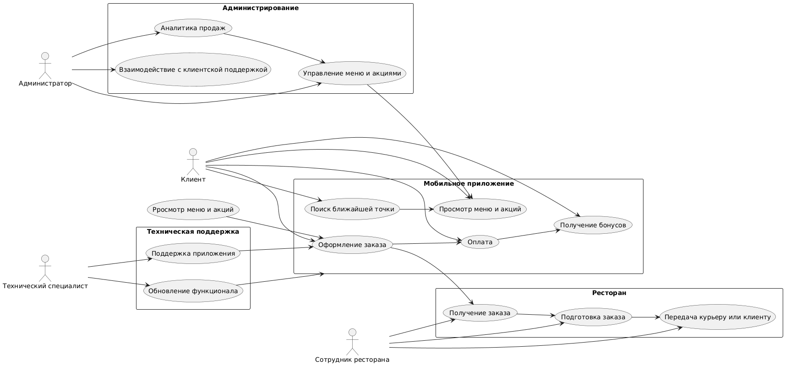

# Стратегия дизайна приложения «Махачкала»

---

## 1. Заинтересованные стороны

| **Категория**               | **Описание**                                                                                     | **Роль в проекте**                                                                 |
|-----------------------------|-------------------------------------------------------------------------------------------------|------------------------------------------------------------------------------------|
| **Клиенты**                 | Студенты, гастарбайтеры, скуфы, туристы                                                        | Основные пользователи приложения, источник дохода                                |
| **Сотрудники ресторанов**   | Исполнители заказов, повара, администраторы точек                                              | Оперативное управление заказами, взаимодействие с клиентами                       |
| **Администраторы сети**     | Менеджеры                                                                                      | Управление меню, акциями, аналитика продаж, стратегия развития                  |
| **Заказчик (владелец сети)**| Руководство сети «Махачкала»                                                                    | Постановка бизнес-задач, бюджет, стратегические решения                           |

---

## 2. Видение продукта заинтересованными лицами

### Задачи пользователей
- **Клиенты**: Быстро и недорого заказать шаурму (5 руб.), найти ближайшую точку, получить бонусы и акции, оформить заказ за 3 клика. **Опрос показал**, что важны **цена, скорость доставки, качество еды и удобство интерфейса**.
- **Сотрудники**: Быстро обрабатывать заказы, минимизировать ошибки, управлять меню и акциями.
- **Администраторы**: Анализировать продажи, управлять сетью, внедрять маркетинговые активности.

### Задачи бизнеса
- Увеличить количество заказов за счёт низкой цены (шаурма за 5 руб.).
- Повысить лояльность клиентов через бонусную систему и акции.
- Оптимизировать работу сотрудников и курьеров.
- Усилить бренд «Махачкала» через дагестанский колорит и уникальное предложение.

---

## 3. Конфликты и противоречия

| **Конфликт**                                      | **Стороны**                     | **Решение**                                                                 |
|----------------------------------------------------|---------------------------------|-----------------------------------------------------------------------------|
| **Скорость vs. Качество**                          | Клиенты vs. Повара              | Оптимизация процессов приготовления, обучение персонала                  |
| **Низкая цена vs. Прибыль**                        | Бизнес vs. Клиенты              | Компенсация за счёт объёма продаж и сопутствующих товаров                  |
| **Сложный интерфейс vs. Простота**                 | Туристы vs. Гастарбайтеры       | Адаптивный дизайн с крупными элементами и возможностью выбора языка         |
| **Офлайн-режим vs. Онлайн-оплата**                 | Скуфы vs. Бизнес                | Поддержка обоих способов оплаты, сохранение корзины в офлайн-режиме         |
| **Персонализация vs. Стандартизация**              | Маркетинг vs. Разработчики      | Гибкие настройки профиля пользователя, шаблоны для стандартных сценариев  |

---

## 4. Задачи бизнеса, маркетинга и брендинга

### Верифицируемые задачи бизнеса
- Увеличить количество заказов на 30% за счёт акции «Шаурма за 5 руб.» в течение 6 месяцев.
- Повысить средний чек на 15% за счёт продажи сопутствующих товаров (напитки, закуски).
- Увеличить количество постоянных клиентов на 20% через бонусную программу.

### Задачи маркетинга
- Продвижение через соцсети, таргетированную рекламу, партнёрские программы.
- Создание вирусного контента вокруг акции «Шаурма за 5 руб.» (мемы, челенджи).
- Локальное продвижение в Минске и Махачкале (наружная реклама, сотрудничество с вузами и стройками).

### Задачи брендинга
- Усилить ассоциацию бренда с Дагестаном: орнаменты, цвета, музыка, терминология.
- Создать эмоциональную связь с клиентами через культурный контекст (истории блюд, традиции). **Опрос показал**, что пользователи заинтересованы в уникальных блюдах и культурном контексте.

---

## 5. Измеримые критерии успешности

| **Критерий**                          | **Цель**                     | **Метрика**                                      | **Срок**       |
|---------------------------------------|------------------------------|--------------------------------------------------|----------------|
| Количество заказов                    | +30%                         | Ежемесячная аналитика                            | 6 месяцев      |
| Средний чек                           | +15%                         | Данные кассовой системы                          | 6 месяцев      |
| Количество постоянных клиентов        | +20%                         | Количество повторных заказов                     | 12 месяцев     |
| Оценка удовлетворённости (NPS)        | ≥ 70                         | Опрос клиентов                                   | Ежемесячно     |
| Время обработки заказа                | ≤ 15 минут                   | Логи приложения                                  | Постоянно      |
| Количество установок приложения       | 50 000                       | Статистика App Store/Google Play                  | 12 месяцев     |

---

## 6. Технические возможности и ограничения

### Технологии и платформы
- **Мобильное приложение**: Android (Java), iOS (Swift).
- **Веб-приложение**: React.js, Node.js.
- **Бэкенд**: Python (Django/Flask), база данных — PostgreSQL.

### Ограничения
- Поддержка устройств с Android 8.0+ и iOS 12+.
- Ограниченный бюджет на разработку и продвижение.
- Необходимость поддержки офлайн-режима для слабых сетей.

---

## 7. Представления заинтересованных лиц о пользователях (целевая аудитория)

### Целевая аудитория
1. **Студенты** (18–25 лет): активные пользователи смартфонов, ценят скорость и низкую цену. **Опрос подтвердил**, что это основная аудитория.
2. **Гастарбайтеры** (25–35 лет): предпочитают крупные иконки, визуальное меню, голосовой ввод.
3. **Скуфы** (35–50 лет): ценят простоту, русскоязычный интерфейс, крупные элементы.
4. **Туристы** (25–40 лет): нуждаются в культурном контексте, многоязычном интерфейсе, навигации.

### Приоритизация
- **Высокий приоритет**: Студенты, гастарбайтеры.
- **Средний приоритет**: Скуфы.
- **Низкий приоритет**: Туристы.

---

## 8. Бюджет и график проекта:

### Бюджет
- Ограниченный бюджет, требуется оптимизация затрат.

### График

| **Этап**               | **Сроки**          | **Ответственные**          |
|------------------------|--------------------|----------------------------|
| Исследование и анализ | 2 недели            | Команда аналитиков         |
| Дизайн                 | 1 месяц             | Дизайнеры                  |
| Разработка             | 2 месяца            | Разработчики              |
| Тестирование           | 2 недели            | QA-инженеры               |
| Запуск и продвижение   | 1 месяц             | Маркетологи, PR-специалисты|
| **Итого**              | 4.5 месяца         |                            |

---
Бизнес-процессы

